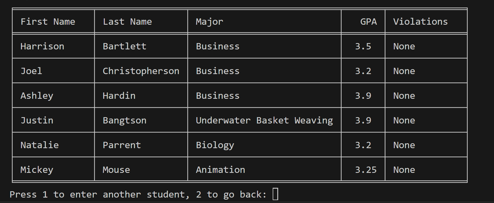
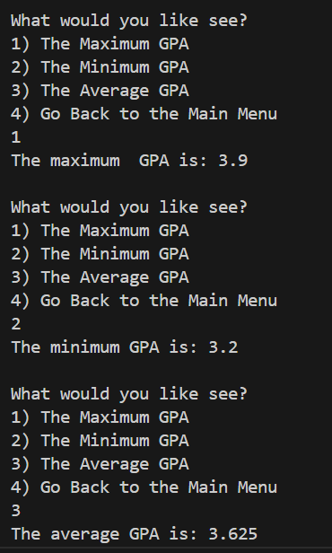
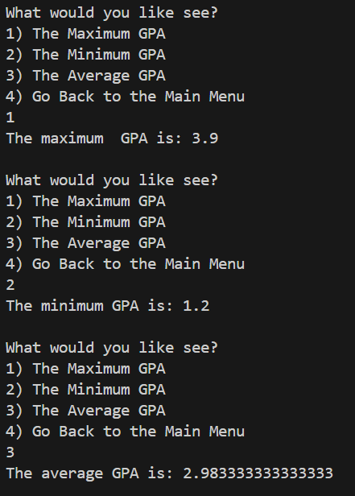
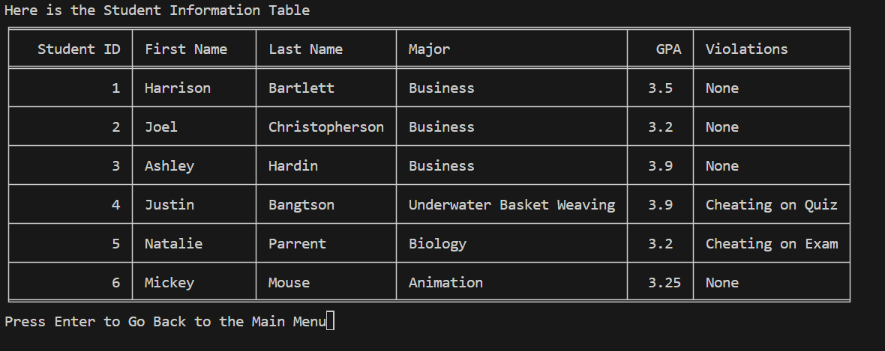

# Collections THA for Natalie Parrent

### 1. After updating your system with your two new students, take a screen capture of Student Information Query

### 2. Query GPA Metrics before you add the 2 new students and after
#### Before

#### After

### 3. Academic Violations: successfully adding violations to two students.
